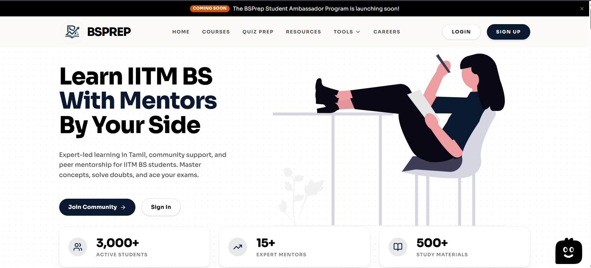
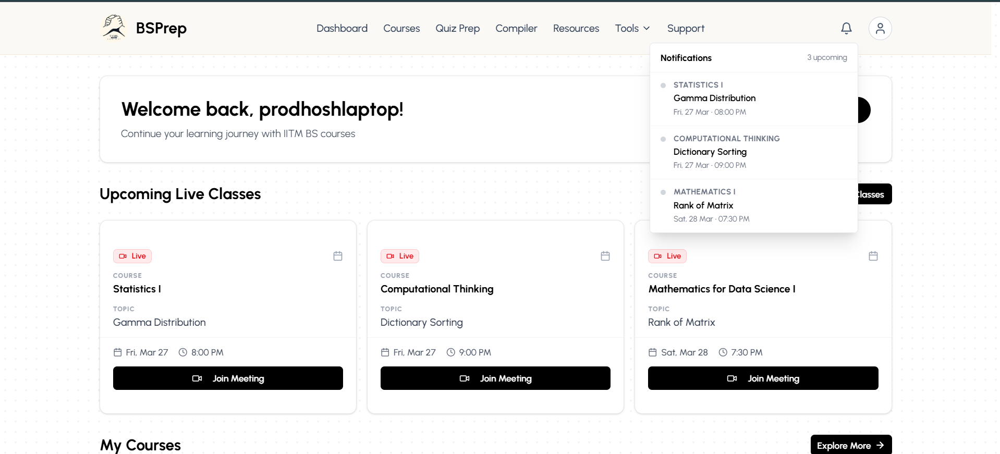
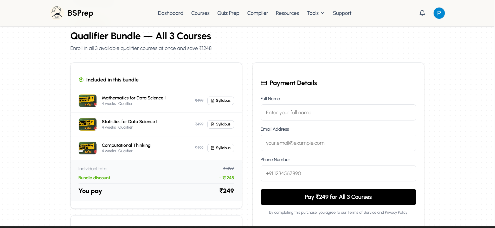
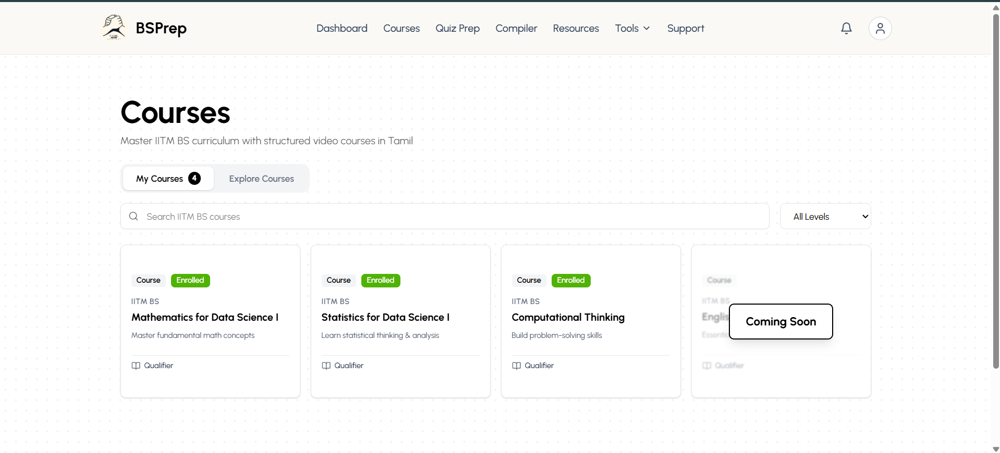
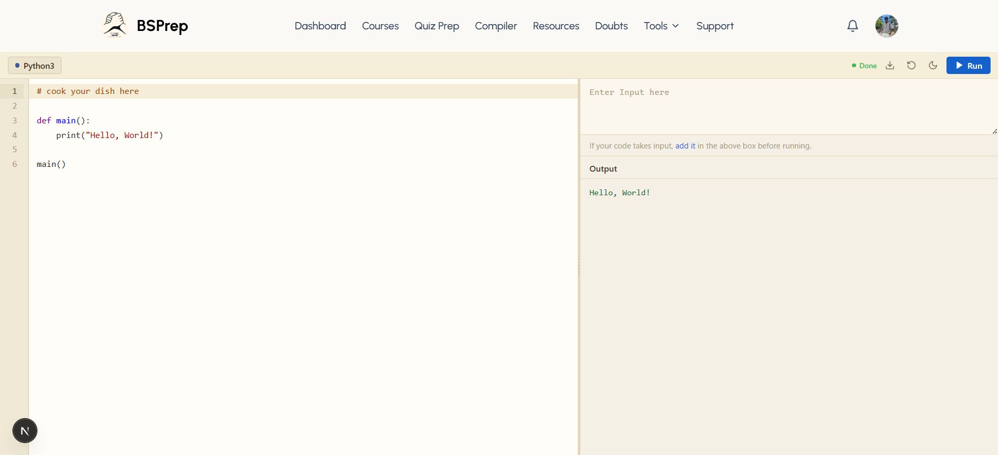

<p align="center">
	
</p>

<h1 align="center">BSPrep</h1>

<p align="center">
	Prep platform for IITM BS students. Courses in Tamil, live classes, compiler, quiz prep, GPA tools, and mentorship.
</p>

<p align="center">
	<sub><a href="https://bsprep.in" target="_blank" rel="noopener noreferrer">bsprep.in</a></sub>
</p>

<p align="center">
	
	
	
	
</p>

---

## What is BSPrep?

BSPrep is a student-built platform for people doing the IITM BS Degree. The focus is the Qualifier exam. We cover all 4 subjects in Tamil with video courses, live doubt sessions, and practice quizzes.

It's not affiliated with IIT Madras. Just students helping students.

**What you get on the platform:**

- Video courses in Tamil for Math, Stats, Computational Thinking, and English
- Live weekly classes with mentors who have already cleared the Qualifier
- In-browser code compiler supporting Python, Java, C, and C++
- Quiz prep with past question practice
- GPA calculator and grade predictor tools
- Leaderboard, community doubts, and mentor sessions
- Secure payments via Razorpay

---

## Showcase

### Hero Section


### Dashboard Preview


### Payment Flow Preview


### Courses Page


### Compiler Preview


---

## Tech Stack

| Layer | Tools |
|---|---|
| Frontend | Next.js 16 App Router, TypeScript, Tailwind CSS, shadcn/ui |
| Backend | Next.js API Routes, Supabase |
| Auth + DB | Supabase Auth, Postgres with Row Level Security |
| Payments | Razorpay (server-side only, no keys on client) |
| Deploy | Vercel |

---

## Run Locally

```bash
git clone https://github.com/IITMBSTamilCommunity/bs-prep
cd bs-prep
npm install
npm run dev
```

Open [http://localhost:3000](http://localhost:3000).

You need a `.env.local` file with your Supabase and Razorpay keys. Ask the team for the dev credentials.

---

## Planned Features

- Study streak tracker
- Quiz history with per-question breakdown
- Mock qualifier (full timed paper, auto-graded)
- AI doubt assistant in Tamil and English
- Live class reminders via email
- Flashcard system
- Mentor slot booking

---

## Disclaimer

This is an independent student project. Not affiliated with or endorsed by IIT Madras.

## Usage Restriction

This code is proprietary.

- You cannot copy, reuse, redistribute, or deploy this anywhere.
- You cannot use it in personal, academic, or commercial projects.
- Any use requires written permission from the BSPrep team.
